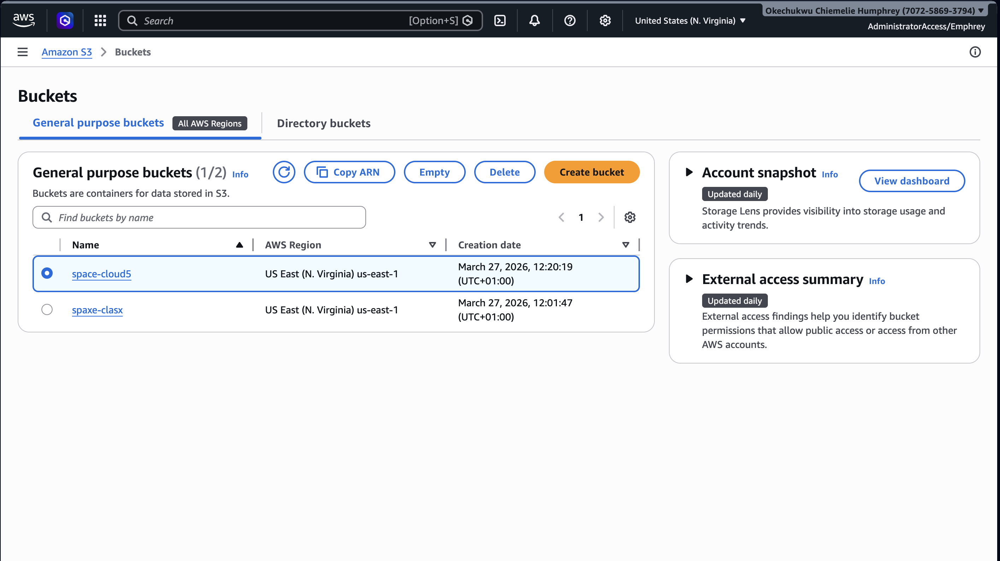
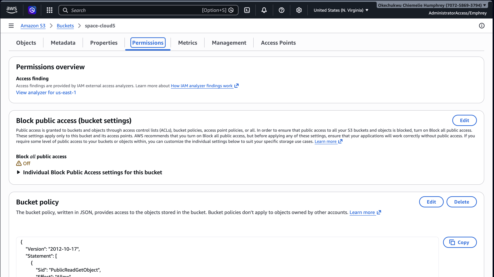
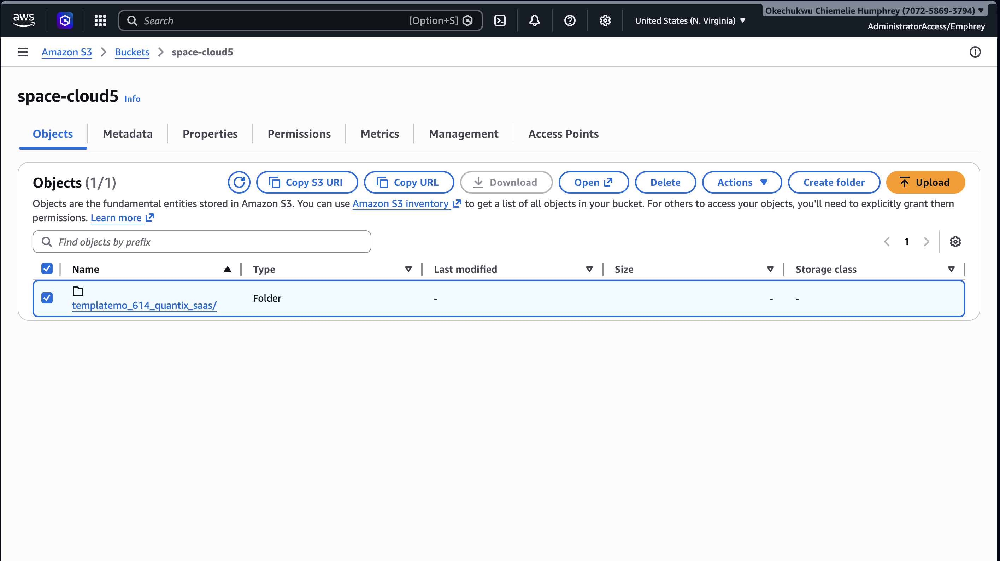
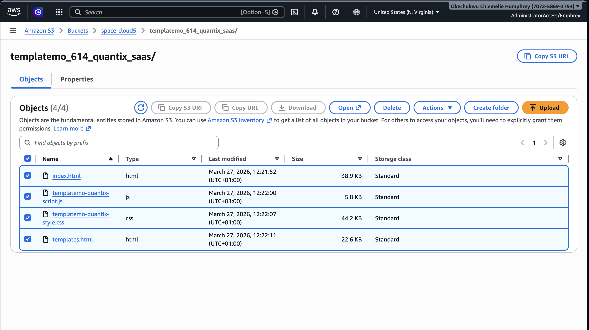
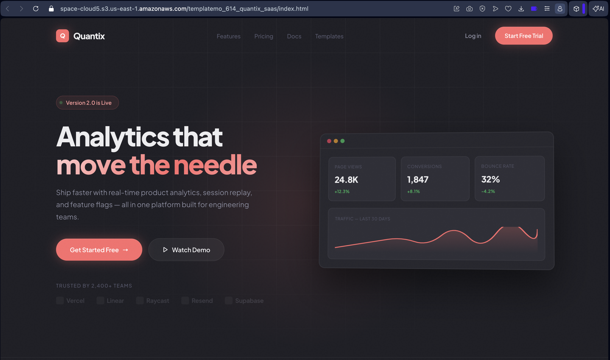
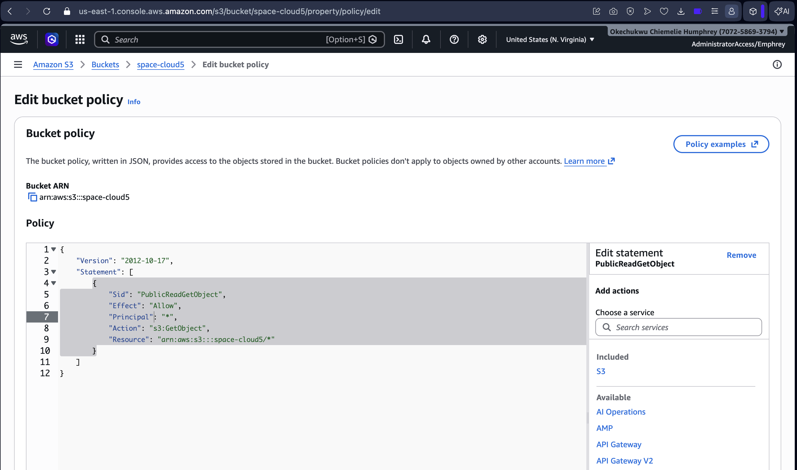

#  Static Website Deployment on AWS S3

##  Project Overview
This project demonstrates how a static website was deployed using **Amazon S3**. The website consists of HTML, CSS, and JavaScript files, which were hosted on AWS to make it publicly accessible over the internet.

---

## Technologies Used
- **Amazon S3** – Static website hosting  
- **Amazon Route 53** (optional) – Domain configuration  
- **HTML, CSS, JavaScript** – Website structure and design  
- **Git & GitHub** – Version control  

---

##   Deployment Steps

### 1. Prepare Website Files
- Downloaded a static website template  
- Extracted the files  
- Ensured the main file was named `index.html`  

---

### 2. Create an S3 Bucket
- Logged into AWS Management Console  
- Navigated to **Amazon S3**  
- Clicked **Create Bucket**  
- Entered a unique bucket name  

- Selected a region  
- Disabled **Block all public access**  

- Created the bucket  

---

### 3. Upload Website Files
- Opened the bucket 

- Clicked **Upload**  
- Uploaded all website files (HTML, CSS, JS, images) 
 
- Confirmed successful upload  

- Click on the index.html and then open to view the static web page

---

### 4. Enable Static Website Hosting
- Went to the **Properties** tab  
- Enabled **Static Website Hosting**  
- Set:
  - Index document: `index.html`  
  - Error document: `error.html` (optional)  
- Saved changes  

### 5. Set Bucket Permissions
Added a bucket policy to allow public access:
